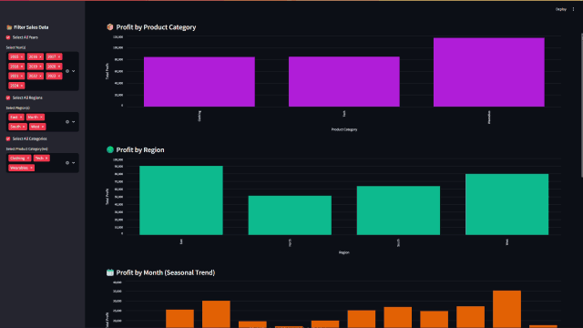
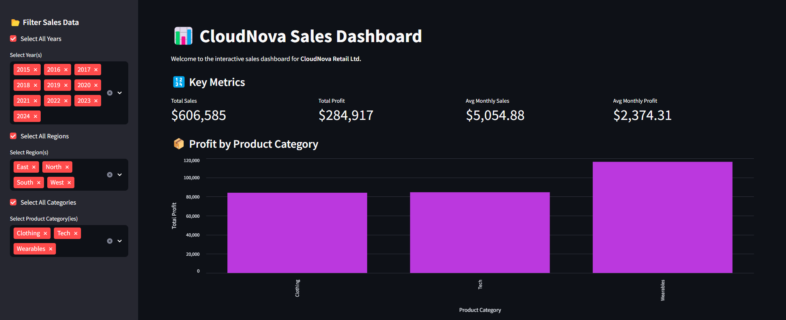
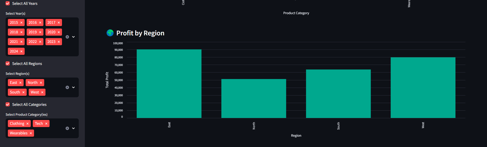
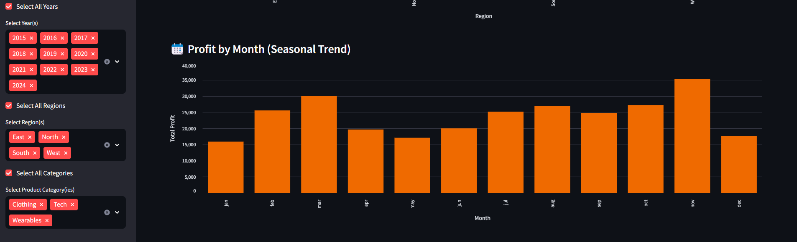
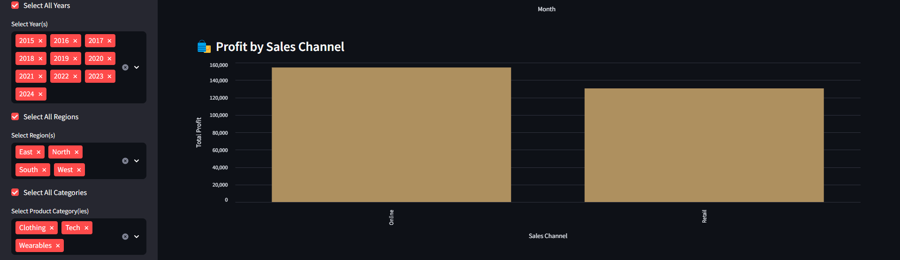
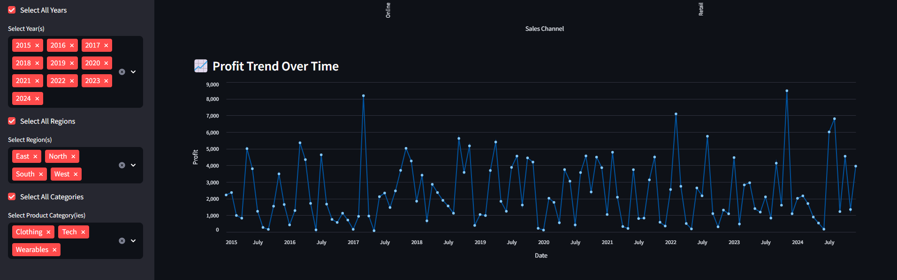

# 📊 CloudNova Sales Dashboard

The **CloudNova Sales Dashboard** is an interactive web-based application designed to explore, analyze, and visualize 10 years of retail sales data (2015–2024) for a fictional tech and lifestyle brand, **CloudNova Retail Ltd.**

This project showcases real-world data analytics capabilities using Python, Streamlit, Pandas, and Altair.

---

## 📘 Table of Contents

- [Overview](#overview)
- [Features](#features)
- [Visuals](#visuals)
- [Technologies Used](#technologies-used)
- [Folder Structure](#folder-structure)
- [Getting Started](#getting-started)
- [Usage](#usage)
- [Example Use Cases](#example-use-cases)
- [Customization](#customization)
- [Author](#author)

---

## 📍 Overview

This project was developed as part of the "Introduction to Python & Apps" course. It is aimed at showcasing core skills in:

- Data cleaning and exploration
- Real-time data filtering and metrics
- Interactive visualizations
- UI/UX thinking in data dashboards
- Preparing a technical project and GitHub deployment

---

## ✨ Features

- ✅ **Filterable by Year, Region, and Product Category**
- ✅ **Select All / Deselect All** functionality for faster exploration
- ✅ Dynamic KPIs:
  - Total Sales
  - Total Profit
  - Average Monthly Sales
  - Average Monthly Profit
- 📊 Interactive Charts:
  - Profit by Product Category
  - Profit by Region
  - Profit by Sales Channel
  - Monthly Seasonal Trends
  - Profit Trend Over Time (Line Chart)
- 📁 Modular structure, clean code, and reusable patterns

---

## 📸 Visuals

### 🔷 Dashboard Preview


### 📦 Profit by Product Category


### 🌍 Profit by Region


### 📆 Seasonal Trends


### 🛍️ Channel Comparison


### 📈 Profit Trend Over Time


---

## 🌐 Technologies Used

- **Python 3.11+**
- [Streamlit](https://streamlit.io/)
- [Pandas](https://pandas.pydata.org/)
- [Altair](https://altair-viz.github.io/)
- HTML/CSS (Streamlit markdown)
- Git + GitHub for version control

---

## 📁 Folder Structure

```
sales-dashboard-project/
│
├── app/
│   └── dashboard.py             # Streamlit app entry point
│
├── data/
│   └── CloudNova_Sales_Data_2015_2024.csv  # Source sales dataset
│
├── analysis/
│   ├── explore_data.py          # Exploratory data analysis script
│   ├── summary.csv              # Generated KPIs from analysis
│   └── *.png                    # Static charts from EDA
│
├── docs/
│   ├── dashboard_demo.gif       # Embedded dashboard demo (for README)
│   ├── *.png                    # Screenshots of dashboard
│   └── project-story.md         # Case study and business story
│
├── requirements.txt             # Python package dependencies
├── .gitignore                   # Ignored files/folders
└── README.md                    # Main GitHub README
```

---

## 🚀 Getting Started

1. **Clone the Repository**

```bash
git clone https://github.com/yourusername/sales-dashboard-project.git
cd sales-dashboard-project
```

2. **Create a Virtual Environment**

```bash
python -m venv .venv
source .venv/bin/activate
```

3. **Install Dependencies**

```bash
pip install -r requirements.txt
```

4. **Run the Dashboard**

```bash
streamlit run app/dashboard.py
```

Visit `http://localhost:8501` in your browser.

---

## ⚡ Usage

### On First Load

- All filters are selected by default
- All KPIs and charts reflect full dataset (2015–2024)

### To Explore Specific Insights

1. Use the **sidebar filters**:
   - Select any combination of years, regions, or product categories
2. View:
   - Updated metrics
   - Refreshed, interactive charts
3. Hover over charts to see tooltips and details
4. Toggle filters freely to explore trends and comparisons

---

## 💼 Example Use Cases

- Identify the **best-performing region** in 2023
- Compare **online vs retail profit** for Tech products
- Spot **seasonal trends** in Wearables
- Analyze profit **growth over time**

---

## 🛠 What's next?

Would be nice to:
- Add export buttons using `st.download_button`
- Include user login using Streamlit’s `st.session_state`
- Replace Altair with Plotly for drill-downs
- Connect to a live database instead of CSV

---

## 👤 Author

Made with ☕ and curiosity by **Alex**  
_CloudNova is a fictional brand created for educational purposes._
